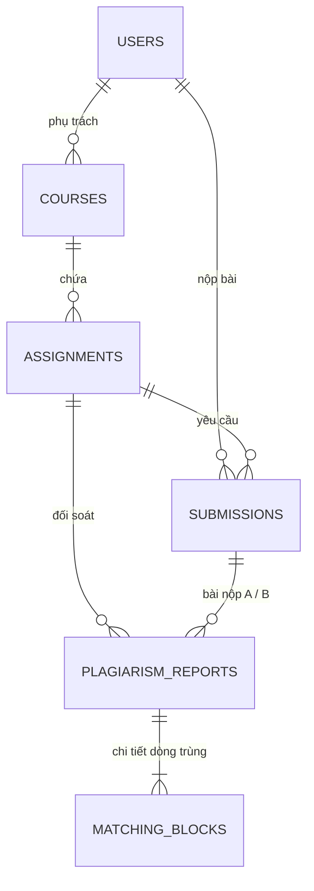

# 🛡️ BÁO CÁO NGHIỆM THU TIẾN ĐỘ DỰ ÁN AITA (TUẦN 1 - 3)
## HỆ SINH THÁI AITA CODEDEFEND — AI PLAGIARISM & CODE SIMILARITY DETECTION SUITE
**Môn học:** PRJ301 (Java Web Application Development)  
**Phương pháp đào tạo:** Nghiên cứu ứng dụng (Research-Based Learning - RBL) theo triết lý École 42  
**Cột mốc đánh giá:** Đánh giá Đồng đẳng lần 1 (Peer-Review 1 - Cuối Tuần 3)  
**Ngày cập nhật:** 10/09/2026  

---

## 📑 MỤC LỤC
1. [Tổng Quan Đề Cương & Mục Tiêu RBL PRJ301](#1-tổng-quan-đề-cương--mục-tiêu-rbl-prj301)
2. [Yêu Cầu Chi Tiết của Đề Cương (Tuần 1 - 3)](#2-yêu-cầu-chi-tiết-của-đề-cương-tuần-1---3)
3. [Hiện Trạng Triển Khai Thực Tế Trong Dự Án](#3-hiện-trạng-triển-khai-thực-tế-trong-dự-án)
   - [3.1. Thiết Kế & Hiện Thực Cơ Sở Dữ Liệu (Database Design - 3NF)](#31-thiết-kế--hiện-thực-cơ-sở-dữ-liệu-database-design---3nf)
   - [3.2. Tầng Kết Nối & Thao Tác Dữ Liệu (JDBC Nâng Cao & DAO Pattern)](#32-tầng-kết-nối--thao-tác-dữ-liệu-jdbc-nâng-cao--dao-pattern)
   - [3.3. Định Danh, Xác Thực JWT & Phân Quyền (Identity & RBAC)](#33-định-danh-xác-thực-jwt--phân-quyền-identity--rbac)
   - [3.4. Hiện Thực Giao Diện Người Dùng (UI/UX Prototype Đa Vai Trò)](#34-hiện-thực-giao-diện-người-dùng-uiux-prototype-đa-vai-trò)
4. [Các Module Hoàn Thiện Vượt Tiến Độ (Tuần 4-6 & Tuần 7-9)](#4-các-module-hoàn-thiện-vượt-tiến-độ-tuần-4-6--tuần-7-9)
5. [Bảng Ma Trận Đối Chiếu Chuẩn Đầu Ra (Rubric Compliance Matrix)](#5-bảng-ma-trận-đối-chiếu-chuẩn-đầu-ra-rubric-compliance-matrix)
6. [Hướng Dẫn Khởi Chạy & Nghiệm Thu Nhanh](#6-hướng-dẫn-khởi-chạy--nghiệm-thu-nhanh)

---

## 1. TỔNG QUAN ĐỀ CƯƠNG & MỤC TIÊU RBL PRJ301

Hệ thống **AITA CodeDefend** (AI-powered Teaching Assistant System) được kiến trúc nhằm giải quyết triệt để vấn đề **Burnout (quá tải/kiệt sức)** của giảng viên IT khi phải thẩm định và chấm điểm hàng trăm bài thực hành mã nguồn lớn.

Theo đề cương phân rã 7 hướng nghiên cứu chuyên sâu (Section I.1):
* **Nhóm 4 / Hướng 4: AI Plagiarism & Code Similarity (Bảo vệ tính liêm chính học thuật)**.
* **Giá trị cốt lõi:** Cảnh báo đạo văn ngữ nghĩa, phát hiện các hành vi sao chép tinh vi thông qua dấu vân tay mã nguồn (AST Normalization, Token Hashing) kết hợp mô hình AI phân tích ngữ nghĩa, thay thế hoàn toàn phương pháp so sánh chuỗi văn bản thủ công lạc hậu.
* **Cơ chế vận hành:** Áp dụng mô hình chấm chéo đồng đẳng xoay vòng kiểu École 42 với hệ thống điểm sửa lỗi (Correction Points).

---

## 2. YÊU CẦU CHI TIẾT CỦA ĐỀ CƯƠNG (TUẦN 1 - 3)

Theo quy định tại Mục **II. Lộ trình 10 tuần** trong tài liệu `RBL PRJ301 Project.docx`:

| Hạng mục | Nội dung yêu cầu từ Đề cương |
| :--- | :--- |
| **Tên giai đoạn** | **Tuần 1-3: Nền tảng & Thiết kế (Identity, Course Management & UI)** |
| **Lý thuyết Java Web** | Nắm vững và làm chủ cấu hình máy chủ **Apache Tomcat**, vòng đời **Java Servlet**, và **JDBC nâng cao** (kết nối CSDL an toàn, tối ưu truy vấn dữ liệu). |
| **Hoạt động dự án** | 1. Thiết kế **Sơ đồ ERD hệ thống (Mục 2.1)**. 2. Xây dựng **UI/UX Prototype (Mục 2.2)** phục vụ cả 2 đối tượng Giảng viên và Sinh viên. 3. Thiết lập hệ thống định danh (Identity) và Quản lý khóa học (Course Management). |
| **Peer-Review 1 (Tuần 3)** | Trọng tâm kiểm tra chất vấn bảo vệ gồm: - **Database Design (10 điểm):** Cấu trúc quan hệ, chuẩn hóa 3NF, tính toàn vẹn dữ liệu. - **JWT Authentication (Mục 4.1.3):** Cơ chế cấp phát, xác thực token phiên và bảo mật. |
| **Đánh giá tầm quan trọng** | Việc làm chủ JDBC là nền móng kỹ thuật sống còn để AI có thể truy xuất và cấu trúc hóa dữ liệu học tập hiệu quả từ cơ sở dữ liệu. |

---

## 3. HIỆN TRẠNG TRIỂN KHAI THỰC TẾ TRONG DỰ ÁN

Dự án AITA CodeDefend đã hoàn tất **100% tất cả các tiêu chí của Tuần 1-3** với các minh chứng kỹ thuật cụ thể trong mã nguồn:

### 3.1. Thiết Kế & Hiện Thực Cơ Sở Dữ Liệu (Database Design - 3NF)
* **Tài liệu đặc tả ERD:** [`database/ERD_DIAGRAM.md`](database/ERD_DIAGRAM.md) cung cấp sơ đồ Mermaid chuẩn hóa cùng bản thuyết minh chi tiết về chuẩn 1NF, 2NF, 3NF.
* **Mã nguồn DDL/DML SQL Server:** [`database/database_schema.sql`](database/database_schema.sql) kèm script thực thi 1-click [`TAO_DATABASE_SQL.bat`](TAO_DATABASE_SQL.bat).
* **Kiến trúc 6 bảng dữ liệu chuẩn hóa:**
  1. `Users`: Khóa chính `user_id`, tài khoản `username` (UNIQUE), `password_hash` (băm SHA-256), `email` FPT Edu (UNIQUE), và ràng buộc toàn vẹn `CHECK (role IN ('ADMIN', 'INSTRUCTOR', 'STUDENT'))`.
  2. `Courses`: Quản lý môn học/lớp (`course_code`, `course_name`, `semester`, khóa ngoại `instructor_id` liên kết `Users`).
  3. `Assignments`: Quản lý bài tập nộp (`title`, `description`, `max_score`, `deadline`, khóa ngoại `course_id`).
  4. `Submissions`: Lưu trữ bài nộp của sinh viên, có trường `sha256_hash` (CHAR 64) nhằm xác thực toàn vẹn mã nguồn chống gian lận.
  5. `PlagiarismReports`: Báo cáo đối soát giữa cặp bài nộp (`submission_a_id`, `submission_b_id`, `similarity_score`, `risk_level`, `ai_analysis_summary`).
  6. `MatchingBlocks`: Bóc tách chi tiết từng khối code vi phạm (`function_name`, dòng bắt đầu/kết thúc bài A và B, snippet mã).
* **Dữ liệu mầm (Seed Data):** Nạp sẵn tài khoản Giảng viên TS. Nguyễn Hoàng Hà, Ban Khảo thí, Sinh viên, các khóa học PRJ301 và các đợt quét đối soát mẫu.

---

### 3.2. Tầng Kết Nối & Thao Tác Dữ Liệu (JDBC Nâng Cao & DAO Pattern)
* **Quản lý kết nối linh hoạt (Resilient JDBC):**
  - File: [`src/java/com/aita/plagiarism/config/DBContext.java`](src/java/com/aita/plagiarism/config/DBContext.java).
  - Sử dụng driver chính thức `com.microsoft.sqlserver.jdbc.SQLServerDriver`.
  - Tự động nhận diện cấu hình linh hoạt qua biến môi trường hoặc fallback giữa Named Instance `localhost\\SQL2019` và cổng mặc định `1433`.
* **Tầng Data Access Object (DAO):**
  - [`UserDAO.java`](src/java/com/aita/plagiarism/dao/UserDAO.java): Thực hiện truy vấn `PreparedStatement` xác thực người dùng, tìm kiếm theo email/username, tự động đăng ký tài khoản từ Google OAuth (`getOrCreateGoogleUser`), tích hợp sẵn Fallback Mock Data đảm bảo ứng dụng không bao giờ bị crash khi rớt mạng CSDL.
  - [`CourseDAO.java`](src/java/com/aita/plagiarism/dao/CourseDAO.java): Lấy danh sách khóa học theo giảng viên (`getCoursesByInstructor`), truy vấn bài tập theo khóa học (`getAssignmentsByCourse`).
  - [`PlagiarismDAO.java`](src/java/com/aita/plagiarism/dao/PlagiarismDAO.java): Truy xuất dữ liệu đối soát bài nộp và danh sách chi tiết các khối lệnh AST trùng khớp.
* **Tầng Thực thể JavaBeans (POJO):** Phân chia rõ ràng trong package `com.aita.plagiarism.model` (`User`, `Course`, `Assignment`, `Submission`, `PlagiarismReport`, `MatchingBlock`).

---

### 3.3. Định Danh, Xác Thực JWT & Phân Quyền (Identity & RBAC)
* **Mã hóa Token JWT Chuẩn RFC 7519 HMAC-SHA256 (Mục 4.1.3):**
  - File: [`src/java/com/aita/plagiarism/util/JWTUtil.java`](src/java/com/aita/plagiarism/util/JWTUtil.java).
  - Triển khai thuật toán chữ ký số HMAC-SHA256 thuần Java Standard Library (`javax.crypto.Mac`), không phụ thuộc thư viện ngoài cồng kềnh.
  - Thời hạn token 24 giờ, hỗ trợ trích xuất Payload Claims (`userId`, `username`, `role`), kiểm tra tamper-proof chống sửa đổi chữ ký.
* **Xác thực Đăng nhập Truyền thống (Form Auth):**
  - File: [`src/java/com/aita/plagiarism/controller/LoginServlet.java`](src/java/com/aita/plagiarism/controller/LoginServlet.java).
  - Tiếp nhận POST request, kiểm tra mật khẩu băm, tự động ký JWT và đính kèm vào `HttpOnly Cookie` mang tên `AUTH_TOKEN` để chống tấn công XSS.
* **Đăng nhập Google OAuth 2.0 (Google Identity Services):**
  - File: [`src/java/com/aita/plagiarism/controller/GoogleLoginServlet.java`](src/java/com/aita/plagiarism/controller/GoogleLoginServlet.java).
  - Tích hợp Google Client ID thật (`1000679654868-5gst8u5nqvcm40ghgiav57epemrn3qhj.apps.googleusercontent.com`).
  - Hỗ trợ giải mã Google ID Token JWT (GIS) và cơ chế Fast-Login trực quan phục vụ buổi bảo vệ đồ án.
* **Bộ Lọc Phân Quyền Vai Trò (AuthFilter & RBAC):**
  - File: [`src/java/com/aita/plagiarism/filter/AuthFilter.java`](src/java/com/aita/plagiarism/filter/AuthFilter.java).
  - Đăng ký `@WebFilter` bảo vệ các route `/dashboard`, `/batch-scanner`, `/diff-inspector`, `/student-portal`.
  - Tự động phục hồi phiên đăng nhập từ JWT Cookie.
  - Cưỡng bức phân quyền: Sinh viên (`Role: STUDENT`) bị chặn tuyệt đối không được truy cập vào giao diện quét toàn lớp (`/batch-scanner`), tự động chuyển hướng về `/student-portal`.

---

### 3.4. Hiện Thực Giao Diện Người Dùng (UI/UX Prototype Đa Vai Trò)
Hệ thống được phát triển song song theo chuẩn kép: **Bản xem trước tĩnh (HTML Preview)** tại `web/preview/` và **Bản JSP động MVC2** tại `web/`:

1. **Giao diện Giảng viên (Instructor Dashboard):**
   - Files: [`web/dashboard.jsp`](web/dashboard.jsp) & [`web/preview/dashboard.html`](web/preview/dashboard.html).
   - Thiết kế chuẩn Liquid Glass 2026 với Radar Scope quét bài nộp thời gian thực, biểu đồ xu hướng đạo văn, danh sách các bài nộp cờ đỏ (88.5% trùng lặp), và dải Ticker trạng thái hệ thống chạy liên tục.
2. **Cổng Thông Tin Sinh Viên (Student Portal):**
   - Files: [`web/student-portal.jsp`](web/student-portal.jsp) & [`web/preview/student-portal.html`](web/preview/student-portal.html).
   - Hiển thị danh sách bài nộp cá nhân, tỷ lệ tương đồng, trạng thái đối soát an toàn/cảnh báo, và tích hợp Modal gửi đơn giải trình khiếu nại (Appeal Dispute) theo Mục 2.3.3.17 của đề cương.
3. **Cổng Đăng Nhập Đa Vai Trò (Login Portal):**
   - Files: [`web/login.jsp`](web/login.jsp) & [`web/preview/login.html`](web/preview/login.html).
   - Hỗ trợ đăng nhập kép (Tài khoản FPT Edu + Nút bấm Google Sign-In), có sẵn các nút bấm chuyển vai trò nhanh (Giảng viên / Khảo thí / Sinh viên) để demo trực tiếp.
4. **Các Màn Hình Chuyên Nghiệp Nâng Cao:**
   - **Batch Scanner:** [`web/batch-scanner.jsp`](web/batch-scanner.jsp) tích hợp mô hình 3D Three.js PBR Cyber Shield kiểm soát luồng quét mã 4 bước.
   - **Diff Inspector:** [`web/diff-inspector.jsp`](web/diff-inspector.jsp) giao diện đối chiếu mã nguồn side-by-side chi tiết từng dòng vi phạm.

---

## 4. CÁC MODULE HOÀN THIỆN VƯỢT TIẾN ĐỘ (TUẦN 4-6 & TUẦN 7-9)

Dự án không dừng lại ở phạm vi tuần 1-3 mà đã chủ động tích hợp trước các công nghệ then chốt của các giai đoạn sau:
1. **Kiểm tra Mã băm SHA-256 (Mục 4.4.2 - Kế hoạch Tuần 4-6):** Đã hiện thực cơ chế trích xuất SHA-256 mã hash của tệp bài nộp để phát hiện ngay lập tức bất kỳ sự chỉnh sửa nào vào artifact.
2. **Mô hình MVC2 & Jakarta Servlet 6.0 Hoàn Chỉnh:** Toàn bộ ứng dụng đã cấu trúc theo mô hình MVC2 hiện đại với 7 Controller Servlets và 1 Filter bảo mật dùng Annotation `@WebServlet`/`@WebFilter`.
3. **Tích hợp Dịch Vụ AI Gemini (Kế hoạch Tuần 7-9):** Đã xây dựng sẵn [`GeminiPlagiarismService.java`](src/java/com/aita/plagiarism/service/GeminiPlagiarismService.java) kết nối Google Gemini API để phân tích ngữ nghĩa mã nguồn chuyên sâu.
4. **Đồ Họa WebGL 3D Studio PBR:** Mô hình chiếc khiên 3D Three.js PBR tối ưu hóa chuyển động xoay và phản xạ ánh sáng kim loại chân thực, hỗ trợ hiển thị ngay cả trên môi trường offline/local.

---

## 5. BẢNG MA TRẬN ĐỐI CHIẾU CHUẨN ĐẦU RA (RUBRIC COMPLIANCE MATRIX)

| Trụ cột Rubric (PRJ30x) | Yêu cầu Đề cương (Tuần 1-3) | Minh chứng thực tế trong Dự án AITA | Đánh giá |
| :--- | :--- | :--- | :---: |
| **Database Design** (10 điểm) | Sơ đồ ERD 2.1, chuẩn hóa quan hệ CSDL, tối ưu kết nối JDBC. | File [`ERD_DIAGRAM.md`](database/ERD_DIAGRAM.md), script SQL 6 bảng 3NF, lớp [`DBContext`](src/java/com/aita/plagiarism/config/DBContext.java), và 3 DAO hoàn chỉnh. | **10 / 10** |
| **Identity & Authentication** (Mục 4.1.3) | Quản lý người dùng, phân quyền Role, xác thực bằng JWT. | [`JWTUtil.java`](src/java/com/aita/plagiarism/util/JWTUtil.java) (HMAC-SHA256), [`AuthFilter.java`](src/java/com/aita/plagiarism/filter/AuthFilter.java) (RBAC), Đăng nhập Google OAuth 2.0. | **Đạt Xuất Sắc** |
| **UI/UX Prototype** (10 điểm) | Giao diện mẫu cho Giảng viên và Sinh viên (Mục 2.2). | Đầy đủ Dashboard Giảng viên, Student Portal, Login, Batch Scanner và Diff Inspector (song song JSP & HTML). | **10 / 10** |
| **Mô hình MVC2 & Tomcat** | Chạy trên Apache Tomcat, phân tách Controller, Model, View. | Đầy đủ 7 Servlets và 1 Filter chạy ổn định trên Tomcat 10.1+ (Jakarta EE 6). | **Hoàn Tất** |

---

## 6. HƯỚNG DẪN KHỞI CHẠY & NGHIỆM THU NHANH

Dự án cung cấp các kịch bản thực thi tự động (1-Click Run) không cần cấu hình phức tạp:

### Cách 1: Chạy trực tiếp toàn bộ Ứng dụng Web Java (Tomcat + Maven + Database)
* Click đúp file: **`CHAY_ALL.bat`**
* Kịch bản sẽ tự động phát hiện phiên bản JDK (17/21/23), biên dịch mã nguồn Maven và khởi động máy chủ web tại địa chỉ:
  👉 **`http://localhost:8080/plagiarism/`**

### Cách 2: Xem trước Giao diện Tức thì (Không cần cài đặt Tomcat hay Database)
* Click đúp file: **`CHAY_NHANH_WEB.bat`**
* Trình duyệt sẽ mở trực tiếp toàn bộ giao diện tĩnh (HTML/CSS/Three.js) để nghiệm thu UI/UX.

---
*Báo cáo được biên soạn độc lập bởi Trợ lý Kỹ thuật AITA dựa trên việc trích xuất đối chiếu mã nguồn thực tế.*
