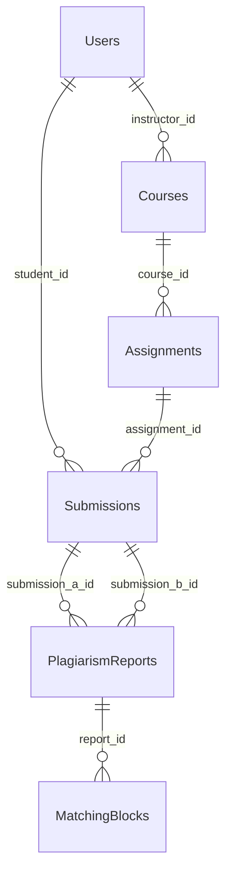

# Kịch bản demo tuần 1–3

Phạm vi nền tảng: đăng nhập, JWT, JDBC/SQL Server, quản lý khóa học và giao diện theo vai trò. Kiểm tra quyền bài tập/báo cáo và nâng cấp mật khẩu là phần sửa bổ sung; không quy đổi thành điểm chấm hoặc xác nhận toàn bộ các tuần sau.

## Chuẩn bị

Chạy `tools/run-java.ps1` với `.env` đã cấu hình. Dùng dữ liệu demo của nhóm; các script kiểm thử chỉ được dùng với `.env.test` và database riêng. Không dùng preview tĩnh cổng 8089 để chứng minh Servlet/JDBC.

**Lưu ý về lưu trữ bài nộp:** artifact được ghi ra thư mục cấu hình bởi `AITA_UPLOAD_DIR` (mặc định `${catalina.base}/aita-uploads`, nằm ngoài web root). Để quét được dữ liệu seed, trỏ `AITA_UPLOAD_DIR=fixtures/submissions` hoặc copy 4 tệp trong `fixtures/submissions/` vào thư mục lưu trữ. Nếu không tìm thấy tệp, lõi quét **bỏ qua cặp đó và báo số cặp bị bỏ qua** — nó không thay nội dung thật bằng nội dung giả để tạo điểm.

## Luồng trình bày

1. Đăng nhập giảng viên. Nêu rõ danh sách khóa học được lọc theo người sở hữu; Admin có thể xem mọi khóa học.
2. Tạo khóa học, chọn khóa vừa tạo. Dashboard phải hiện đúng một khóa được thêm và trạng thái chưa có bài tập/báo cáo; không xuất hiện sinh viên hoặc biểu đồ mẫu.
3. Tạo bài tập với tiêu đề, deadline và ngưỡng. Sửa tiêu đề rồi mở lại: deadline và ngưỡng phải giữ đúng giá trị. Thử ngưỡng 0 để minh họa không bị đổi ngầm thành 75.
4. Chọn bài tập có dữ liệu. Đối chiếu số bài nộp, số báo cáo với SQL Server. Đây là số liệu tại thời điểm tải trang; điểm tương đồng không tự kết luận vi phạm.
5. Bấm một báo cáo: ID, tên sinh viên, điểm và các khối mã phải khớp bản ghi được chọn. Khi chưa có khối mã, trang nói rõ chưa có dữ liệu.
6. Đăng nhập giảng viên khác trong phiên riêng; gửi lại URL báo cáo hoặc request sửa bài tập của người trước: HTTP 403 và dữ liệu không đổi.
7. Đăng nhập sinh viên: chỉ thấy lịch sử bài nộp của mình. Kết quả chỉ chứa điểm/thời gian; không cung cấp tên hay mã nguồn người đối chiếu. Sinh viên khác không liên quan không được xem báo cáo đó.
8. Với tài khoản thử nghiệm riêng, minh họa đăng nhập hash cũ rồi kiểm tra định dạng mới trong DB. Không đưa mật khẩu/hash thật lên slide. Đổi mật khẩu, kiểm tra mật khẩu cũ bị từ chối và mật khẩu mới đăng nhập được.

## Ma trận quyền đang triển khai

| Thao tác | Khách | Sinh viên | Giảng viên | Admin |
|---|---|---|---|---|
| Đăng nhập | Có | Có | Có | Có |
| Xem dashboard | Không | Không | Khóa mình quản lý | Mọi khóa |
| Tạo/sửa/xóa bài tập | Không | Không | Khóa mình quản lý | Mọi khóa |
| Kích hoạt scan | Không | Không | Bài tập thuộc khóa mình | Mọi bài tập |
| Xem báo cáo đầy đủ/khối mã | Không | Không | Khóa mình quản lý | Mọi báo cáo |
| Xem điểm đối soát cá nhân | Không | Báo cáo chứa bài của mình | Qua báo cáo đầy đủ | Qua báo cáo đầy đủ |
| Xóa bài nộp | Không | Bài của mình | Thuộc khóa mình quản lý | Mọi bài nộp |
| Đổi mật khẩu | Không | Tài khoản mình, cần mật khẩu cũ | Như sinh viên | Như sinh viên |
| Truy cập file thô `/uploads/` | Không | Không | Không | Không |

## Quan hệ dữ liệu

Schema vẫn gồm sáu bảng. Không thêm bảng hồ sơ hay thay đổi quan hệ để triển khai các bản sửa này. `Users.role` xác định vai trò; `Courses.instructor_id` và `Submissions.student_id` xác định sở hữu bản ghi.

`PlagiarismReports` **không** lưu `assignment_id`: cột này là phụ thuộc bắc cầu qua `Submissions` nên đã được loại bỏ khỏi schema; assignment của một báo cáo được suy ra từ `Submissions.assignment_id`, và ràng buộc "hai bài nộp cùng một assignment" được bảo đảm bằng trigger `TR_PlagiarismReports_SameAssignment`. (Sơ đồ trên đã bỏ cạnh `Assignments → PlagiarismReports` cho khớp schema.)

Sinh viên hiện được xem danh sách bài tập chung; schema chưa có quan hệ đăng ký môn. Không mô tả hệ thống là đã lọc bài tập theo lớp đăng ký. Không có chức năng chuyển chủ khóa học trong bản này.

## Quyết định lưu mật khẩu

- Chọn PBKDF2-HMAC-SHA256 của JDK 17, 600.000 vòng, salt ngẫu nhiên 16 byte và đầu ra 32 byte. Argon2id là phương án thay thế cần thư viện bổ sung.
- Giữ khả năng kiểm tra MD5/SHA-256 cũ để chuyển đổi khi đăng nhập đúng. Cập nhật có điều kiện theo hash đã đọc; hai lần đổi đồng thời không ghi đè kết quả của nhau.
- Xem lại thuật toán/work factor khi thay nền tảng, chính sách bảo mật hoặc sau đo tải đăng nhập. Tham khảo [OWASP Password Storage](https://cheatsheetseries.owasp.org/cheatsheets/Password_Storage_Cheat_Sheet.html).

Mật khẩu mới trong chức năng đổi mật khẩu dài 8–1024 ký tự. Phiên đã cấp trước khi đổi mật khẩu chưa có cơ chế thu hồi toàn bộ; không tuyên bố đã giải quyết session revocation.

## Các phần không dùng làm bằng chứng hoàn thành

Google login đã được triển khai riêng theo GOOGLE_LOGIN.md. Hướng B đã làm thật: ma trận NxN đọc từ PlagiarismReports đã lưu, lọc trạng thái chấm PENDING/PARSED/ANALYZED/FLAGGED, export CSV có redaction sinh viên, Gemini có timeout/quota/fallback gắn nhãn, Docker có Dockerfile + compose mẫu. Chưa làm: biểu đồ xu hướng, giải trình tự động, export PDF, sandbox chấm điểm cô lập, scan đồng thời nguyên tử/rollback. Scan engine còn cần kiểm tra tính nguyên tử khi nhiều scan đồng thời, khả năng rollback và chất lượng đọc file/thuật toán. Các số liệu có sẵn trong database demo chỉ chứng minh hiển thị bản ghi, không chứng minh AI đã tạo chúng.

## Tái chạy kiểm tra

- `tools/test-java.ps1`: unit và JDBC trên database kiểm thử.
- `tools/run-java.ps1 -EnvironmentFile .env.test`, sau đó `python tools/verify_followup_http.py`: baseline tuần 1–3 cùng kiểm tra quyền, đổi mật khẩu đồng thời và dữ liệu dashboard.
- `python tools/verify_followup_browser.py`: Edge headless tại 1440, 768 và 375 px, chọn bài tập, mở báo cáo và xem kết quả riêng của sinh viên. Script dùng các tài khoản/bài tập seed của database kiểm thử.
- Báo cáo nằm trong `target/surefire-reports`, `target/followup-http-verification.json`, `target/followup-browser`.
