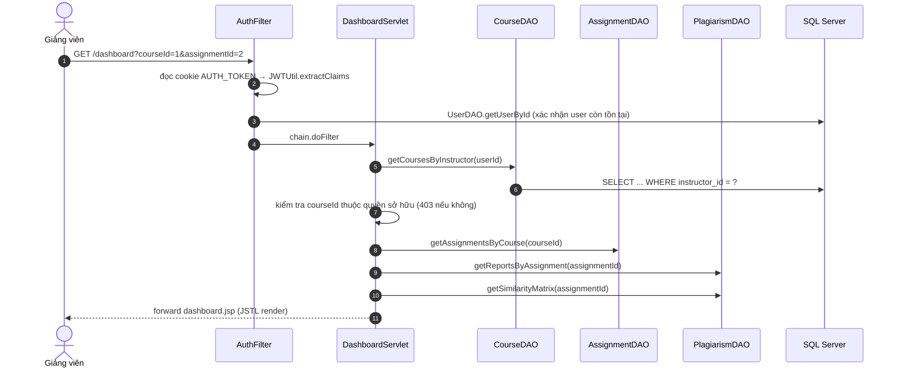
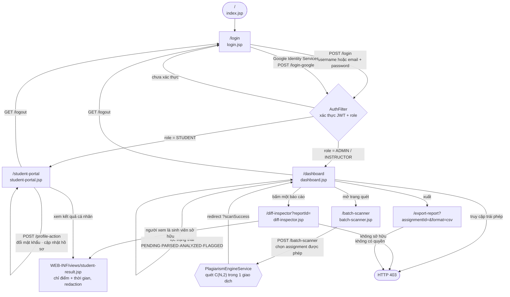

# THIẾT KẾ KIẾN TRÚC & LUỒNG MÀN HÌNH — AITA CODEDEFEND

**Nhóm 7 (SE20C) · PRJ301 · Cập nhật 18/09/2026**
Tài liệu này bổ sung cho [SRS](SOFTWARE_REQUIREMENTS_SPECIFICATION_SRS.md). Mọi node trong hai sơ đồ dưới đây **đều là lớp hoặc tệp có thật** trong repo — không có node nào mang tính dự kiến.

---

## 1. SƠ ĐỒ KIẾN TRÚC MVC2 & CẤU TRÚC PACKAGE

### 1.1. Phân lớp (MVC2)

```mermaid
flowchart TB
    subgraph VIEW["VIEW — web/ (JSP + JSTL)"]
        direction LR
        V1["index.jsp<br/>landing 3D"]
        V2["login.jsp"]
        V3["dashboard.jsp<br/>+ WEB-INF/views/dashboard-data.jspf"]
        V4["student-portal.jsp"]
        V5["diff-inspector.jsp<br/>+ WEB-INF/views/student-result.jsp"]
        V6["batch-scanner.jsp"]
    end

    subgraph FILTER["FILTER — com.aita.plagiarism.filter"]
        F1["AuthFilter<br/>@WebFilter('/*')"]
    end

    subgraph CONTROLLER["CONTROLLER — com.aita.plagiarism.controller"]
        direction LR
        C1["LoginServlet<br/>LogoutServlet<br/>GoogleLoginServlet"]
        C2["DashboardServlet<br/>CourseActionServlet<br/>AssignmentActionServlet"]
        C3["SubmissionServlet<br/>BatchScannerServlet"]
        C4["DiffInspectorServlet<br/>ExportReportServlet<br/>StudentPortalServlet<br/>UserProfileActionServlet"]
    end

    subgraph SERVICE["SERVICE — com.aita.plagiarism.service"]
        direction LR
        S1["AccessPolicy<br/>phân quyền sở hữu"]
        S2["PlagiarismEngineService<br/>lexer + Jaccard + Levenshtein"]
        S3["GeminiPlagiarismService<br/>GoogleIdentityVerifier"]
    end

    subgraph DAO["DAO — com.aita.plagiarism.dao"]
        direction LR
        D1["UserDAO"]
        D2["CourseDAO<br/>AssignmentDAO"]
        D3["SubmissionDAO<br/>PlagiarismDAO"]
        D4["DataAccessException<br/>→ HTTP 409 / 503"]
    end

    subgraph MODEL["MODEL — com.aita.plagiarism.model"]
        M1["User · Course · Assignment<br/>Submission · PlagiarismReport · MatchingBlock"]
    end

    subgraph UTIL["UTIL & CONFIG"]
        direction LR
        U1["util/JWTUtil<br/>util/PasswordUtil<br/>util/SHA256ChecksumUtil"]
        U2["config/DBContext<br/>config/StorageConfig"]
    end

    subgraph DB[("DATA — Microsoft SQL Server")]
        T1["6 bảng 3NF<br/>Users · Courses · Assignments<br/>Submissions · PlagiarismReports · MatchingBlocks"]
    end

    VIEW -->|"HTTP request"| FILTER
    FILTER -->|"chain.doFilter"| CONTROLLER
    CONTROLLER -->|"ủy quyền nghiệp vụ"| SERVICE
    CONTROLLER -->|"đọc/ghi dữ liệu"| DAO
    SERVICE --> DAO
    SERVICE --> UTIL
    DAO --> UTIL
    CONTROLLER -->|"forward + request attributes"| VIEW
    CONTROLLER -.->|"gán thuộc tính"| MODEL
    SERVICE -.-> MODEL
    DAO -.->|"map ResultSet"| MODEL
    UTIL --> DB
```

### 1.2. Luồng truy vết một request (end-to-end)

Ví dụ: giảng viên mở trang tổng quan của một bài tập.



### 1.3. Quy tắc ràng buộc giữa các lớp

| Từ | Được phép gọi | Không được phép |
| :--- | :--- | :--- |
| `controller` | `service`, `dao`, `model`, `util` | chứa logic nghiệp vụ; nối chuỗi SQL |
| `service` | `dao`, `model`, `util` | truy cập `HttpServletRequest`/`HttpServletResponse` |
| `dao` | `config`, `model` | trả dữ liệu giả khi CSDL lỗi (phải ném `DataAccessException`) |
| `model` | — (JavaBean thuần) | chứa logic truy vấn |
| JSP (View) | JSTL/EL trên attribute do controller gọi | scriptlet; gọi trực tiếp DAO |

---

## 2. SƠ ĐỒ LUỒNG MÀN HÌNH (SCREEN FLOW)



### 2.1. Bảng màn hình ↔ controller ↔ quyền

| Màn hình | URL | Controller | JSP | Quyền |
| :--- | :--- | :--- | :--- | :--- |
| Trang chủ 3D | `/` | — | `index.jsp` | Công khai |
| Đăng nhập | `/login` | `LoginServlet` | `login.jsp` | Công khai |
| Đăng nhập Google | `/login-google` | `GoogleLoginServlet` | — | Công khai (POST) |
| Tổng quan | `/dashboard` | `DashboardServlet` | `dashboard.jsp` | ADMIN, INSTRUCTOR |
| Quét hàng loạt | `/batch-scanner` | `BatchScannerServlet` | `batch-scanner.jsp` | ADMIN, INSTRUCTOR |
| Đối chiếu | `/diff-inspector` | `DiffInspectorServlet` | `diff-inspector.jsp` | ADMIN, INSTRUCTOR, STUDENT (chỉ kết quả của mình) |
| Kết quả sinh viên | — (forward) | `DiffInspectorServlet` | `WEB-INF/views/student-result.jsp` | STUDENT |
| Cổng sinh viên | `/student-portal` | `StudentPortalServlet` | `student-portal.jsp` | STUDENT |
| Nộp / xoá bài | `/submit`, `/submission-action` | `SubmissionServlet` | — (redirect) | Đã đăng nhập |
| Hồ sơ / mật khẩu | `/profile-action` | `UserProfileActionServlet` | — (redirect) | Đã đăng nhập |
| Xuất CSV | `/export-report` | `ExportReportServlet` | — (tải file) | Theo phạm vi sở hữu |

### 2.2. Các điểm chặn bảo mật trên luồng

1. **`AuthFilter` chạy trước mọi request** (`@WebFilter("/*")`); danh sách trắng gồm `/`, `/index.jsp`, `/login`, `/login.jsp`, `/login-google`, `/logout`, `/favicon.ico`, `/assets/*`, `/preview/*`.
2. **Tập `STAFF`** (`/dashboard`, `/batch-scanner`, `/course-action`, `/assignment-action`) bắt buộc `role ∈ {ADMIN, INSTRUCTOR}`.
3. **Mọi request không phải GET/HEAD** bị kiểm tra `Origin` và `Sec-Fetch-Site` (chống CSRF).
4. **`/uploads/*` bị chặn với mọi vai trò**, kể cả Admin.
5. **URL `.jsp` được chuyển hướng về controller** tương ứng, không cho truy cập trực tiếp.
6. **Quyền sở hữu được kiểm tra lại trong câu SQL**, không chỉ ở servlet (`CourseDAO`, `AssignmentDAO`, `SubmissionDAO`).

---

## 3. ĐỐI CHIẾU VỚI TIÊU CHÍ CHẤM MILESTONE 1

| Tiêu chí rubric | Sản phẩm bàn giao | Vị trí |
| :--- | :--- | :--- |
| ERD ≥ 5 thực thể ở dạng 3NF, đầy đủ PK/FK | ERD 6 thực thể + lập luận 3NF + trigger | `database/ERD_DIAGRAM.md` |
| Cấu trúc package MVC được vẽ rõ ràng | Sơ đồ phân lớp + luồng truy vết request | **Mục 1 của tài liệu này** |
| Luồng màn hình nhất quán với use case | Sơ đồ luồng màn hình + bảng URL/quyền | **Mục 2 của tài liệu này** |
| Đặc tả yêu cầu đầy đủ | SRS 7 module + trạng thái triển khai | `SOFTWARE_REQUIREMENTS_SPECIFICATION_SRS.md` |
