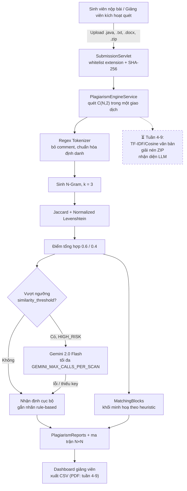

# 🛡️ AITA CodeDefend — AI Plagiarism & Code Similarity Detection Suite

## Trạng thái tuần 1–3 và cách chạy Java

[Kịch bản demo, ERD và ma trận quyền hiện tại](DEMO_TUAN_1_3.md). Dashboard đã dùng số liệu DB theo phạm vi người xem; mật khẩu cũ được nâng cấp PBKDF2 khi đăng nhập. Mô tả AI/Docker bên dưới là định hướng, không phải bằng chứng nghiệm thu.

Xem [báo cáo kiểm chứng tuần 1–3](BAO_CAO_TIEN_DO_TUAN_1_3.md) để phân biệt phần đã kiểm tra và các giai đoạn chưa nghiệm thu.

- Cấu hình .env theo .env.example: SQL Server, tài khoản database có quyền giới hạn, JWT_SECRET ngẫu nhiên tối thiểu 32 byte, CATALINA_HOME trỏ Tomcat 10.1.
- Chạy Java thật: `powershell -NoProfile -ExecutionPolicy Bypass -File tools/run-java.ps1`.
- URL: http://localhost:8080/plagiarism/login. Dừng: thêm `-Stop` vào lệnh trên.
- Prototype tĩnh ở cổng 8089 không thực thi Servlet/JDBC.
- Google login dùng Google Identity Services, xác minh ID token phía server và liên kết tài khoản đã được cấp sẵn; xem [cấu hình Google login](GOOGLE_LOGIN.md).
- Chạy test bằng tools/test-java.ps1 với .env.test và database riêng. Test không được chạy trên database ứng dụng.
- Script database/database_schema.sql không reset dữ liệu hay thay đổi login quản trị.


[](https://www.oracle.com/java/)
[](https://jakarta.ee/)
[](https://tomcat.apache.org/)
[](https://maven.apache.org/)
[](https://threejs.org/)
[](https://greensock.com/)
[](LICENSE)

> **Hệ thống Phát hiện Trùng lặp Mã nguồn & Đạo văn Tích hợp AI** — Dự án Nghiên cứu Ứng dụng (RBL - Research-Based Learning) môn **PRJ301** (Nhóm 7).
> Nền tảng cho phép giảng viên và sinh viên nộp bài hàng loạt, phân tích tương đồng thuật toán (Code Similarity) và kiểm tra dấu vết văn bản/mã nguồn sinh bởi AI (LLM Detection).

---

## 📑 Mục Lục
- [Kiến trúc Hệ thống](#-kiến-trúc-hệ-thống)
- [Tính năng Nổi bật](#-tính-năng-nổi-bật)
- [Luồng Hoạt động (Pipeline Flow)](#-luồng-hoạt-động-pipeline-flow)
- [Thuật toán Đối soát](#-thuật-toán-đối-soát)
- [Yêu cầu Môi trường](#-yêu-cầu-môi-trường)
- [Hướng dẫn Cài đặt & Chạy](#-hướng-dẫn-cài-đặt--chạy)
- [Cấu trúc Thư mục](#-cấu-trúc-thư-mục)
- [Thành viên Nhóm](#-thành-viên-nhóm)

---

## 🏛️ Kiến trúc Hệ thống

```
+-------------------------------------------------------------------------+
|                        Modern Web UI Layer                              |
|   - 3D Scrollytelling (Three.js WebGL + Cyber Shield GLB Model)        |
|   - Liquid Glass UI 2026 / GSAP 3 ScrollTrigger                         |
|   - Multi-role Dashboards (Student / Instructor / Admin)                |
+-------------------------------------------------------------------------+
                                    │ HTTP / REST / JSP
                                    ▼
+-------------------------------------------------------------------------+
|                   Backend Service Layer (Jakarta Servlet 6)                  |
|   - Auth & Session Controller (Google OAuth2 + Form Auth)               |
|   - Submission & Batch File Processor (.java, .txt, .docx, .zip)        |
|   - Plagiarism & Similarity Calculation Service                         |
|   - AI Content Heuristic & Detection Engine                             |
+-------------------------------------------------------------------------+
                                    │ JDBC Connection Pool
                                    ▼
+-------------------------------------------------------------------------+
|                       Data Persistence Layer                            |
|   - Microsoft SQL Server                                        |
|   - Schemas: Users, Courses, Assignments, Submissions, PlagiarismReports, MatchingBlocks (6 bảng, 3NF)  |
+-------------------------------------------------------------------------+
```

---

## ✨ Tính năng Nổi bật

1. **Đối soát mã nguồn Java (Code Similarity Engine) — đã triển khai:**
   - Hỗ trợ tải lên nhiều bài nộp mã nguồn Java (.java, .txt).
   - Token hóa bằng biểu thức chính quy, loại bỏ comment, chuẩn hóa định danh biến/hàm thành `$ID_n`.
   - Tính Jaccard trên tập n-gram (k = 3) và Normalized Levenshtein; điểm tổng hợp = 0.6·Jaccard + 0.4·Levenshtein.
   - Xuất ma trận độ tương đồng N×N giữa từng cặp bài.
   - *Lưu ý:* thực hiện tuần tự bằng regex tokenizer, **không** dùng AST/JavaParser và **không** đa luồng.

2. **So sánh văn bản tiếng Anh & bài luận (TF-IDF + Cosine) — ⏳ dự kiến tuần 4–9:**
   - Chưa có mã nguồn. Hiện tại lõi đối soát xử lý mọi chuỗi ký tự như nhau, không phân biệt ngôn ngữ.

3. **Phân tích dấu vết AI (AI Content & LLM Detection) — ⏳ dự kiến tuần 4–9:**
   - Chưa triển khai đánh giá Perplexity/Burstiness.
   - Đã triển khai: `GeminiPlagiarismService` gọi `gemini-2.0-flash` cho các cặp nguy cơ cao trong hạn mức; khi thiếu khóa hoặc lỗi, hệ thống lưu nhận định cục bộ và **gắn nhãn rõ ràng là không phải kết quả AI**.

4. **Trải nghiệm Thị giác (Scrollytelling + mô hình 3D):**
   - **Trang chủ** (`index.jsp`): hiệu ứng cuộn bằng **canvas 2D** vẽ 240 khung hình `frame_*.webp` (`scrollytelling-engine.js`). Không dùng WebGL ở trang này.
   - **Mô hình 3D** chiếc khiên Cyber Shield (`cyber-shield.glb`, Three.js r128) xuất hiện trên **`login.jsp`** và **`batch-scanner.jsp`** qua `cyber-shield-3d.js`.
   - *Đã kiểm chứng bằng trình duyệt (18/09/2026)*: trang chủ không tải Three.js.
   - Giao diện Liquid Glass phong cách tương lai 2026.

5. **Khởi chạy 1-Click Tương thích Đa máy (Multi-Machine Portable):**
   - Kịch bản `CHAY_ALL.bat` tự động quét tìm JDK (Java 17, 21, 23...), cấu hình môi trường, build Maven và chạy ứng dụng mà không cần thiết lập biến môi trường thủ công.

---

## 🔄 Luồng Hoạt động (Pipeline Flow)



---

## ⚙️ Thuật toán Đối soát

Bảng dưới đây chỉ liệt kê những thuật toán **thực sự có trong mã nguồn**. Các hạng mục chưa triển khai được ghi rõ trạng thái.

| Hạng mục | Thuật toán Áp dụng | Trạng thái | Mục đích |
| :--- | :--- | :--- | :--- |
| **Java Code** | Token-based Jaccard Index (n-gram, k = 3) | ✅ Đã triển khai | Đo tỷ lệ tập n-gram token trùng lặp |
| **Java Code** | Normalized Levenshtein Distance | ✅ Đã triển khai | Đo khoảng cách chỉnh sửa giữa chuỗi token |
| **Java Code** | Điểm tổng hợp `0.6·Jaccard + 0.4·Levenshtein` | ✅ Đã triển khai | Tổng hợp độ tương đồng mã nguồn |
| **English Text** | TF-IDF + Cosine Similarity | ⏳ Tuần 4–9 | So sánh góc vector giữa các bài luận |
| **English Text** | 3-Gram Overlap | ⏳ Tuần 4–9 | Phát hiện sao chép nguyên văn từng đoạn |
| **AI Detection** | Heuristic Perplexity & Burstiness | ⏳ Tuần 4–9 | Đánh giá xác suất văn bản do AI sinh |
| **AI Analysis** | Gemini 2.0 Flash (có hạn mức + fallback gắn nhãn) | 🟡 Một phần | Nhận định ngữ nghĩa cho cặp nguy cơ cao |

Chi tiết từng hạng mục và bằng chứng `file:line`: xem [SRS Mục 0](SOFTWARE_REQUIREMENTS_SPECIFICATION_SRS.md#0-trạng-thái-triển-khai-tính-đến-18092026).

---

## 💻 Yêu cầu Môi trường

- **Java:** JDK 17 LTS trở lên (khuyên dùng JDK 17 hoặc JDK 21)
- **Apache Maven:** Phiên bản 3.8+
- **Application Server:** Apache Tomcat 10.1+ (Hỗ trợ Jakarta Servlet 6)
- **Cơ sở dữ liệu:** Microsoft SQL Server (2019+)
- **Trình duyệt:** Chrome, Edge, Brave, Firefox (Hỗ trợ WebGL cho 3D)

---

## 🚀 Hướng dẫn Cài đặt & Chạy

### Cách 1: Chạy tự động 1-Click (Khuyên dùng trên Windows)

1. Clone repository về máy:
   ```bash
   git clone https://github.com/Phucstack/aita-plagiarism-detection.git
   cd aita-plagiarism-detection
   ```
2. Nhấp đúp chạy file **`CHAY_ALL.bat`** (hoặc mở Command Prompt chạy `CHAY_ALL.bat`).
   - Script sẽ tự nhận diện Java, biên dịch mã nguồn và khởi động hệ thống.
3. Để xem nhanh giao diện Web tĩnh: Nhấp đúp chạy **`CHAY_NHANH_WEB.bat`** và truy cập `http://localhost:8089`.

---

### Cách 2: Chạy thủ công với Maven & Tomcat

1. **Biên dịch dự án:**
   ```bash
   mvn clean package
   ```
   File WAR hoàn chỉnh sẽ nằm tại: `target/aita-plagiarism-detection-1.0.0-SNAPSHOT.war`.

2. **Triển khai lên Tomcat:**
   - Copy file WAR vào thư mục `webapps/` của Apache Tomcat 10.1.
   - Khởi động Tomcat bằng lệnh: `bin/startup.bat` (Windows) hoặc `bin/startup.sh` (Linux/macOS).
   - Truy cập: `http://localhost:8080/aita-plagiarism-detection-1.0.0-SNAPSHOT`

---

## 📂 Cấu trúc Thư mục

```
AITA-CodeDefend-PRJ301/
├── CHAY_ALL.bat                         # Kịch bản chạy toàn diện đa máy
├── CHAY_NHANH_WEB.bat                   # Kịch bản chạy nhanh web preview
├── database/                            # Scripts tạo bảng và dữ liệu mẫu SQL
│   └── database_schema.sql
├── src/
│   ├── java/                            # Mã nguồn Backend Jakarta EE (Servlets, DAO, Models, Services)
│   └── test/java/                       # Bộ kiểm thử tự động JUnit 5
├── web/                                 # Giao diện Frontend, JSP, Assets
│   ├── assets/
│   │   ├── css/                         # Liquid Glass, Motion Effects, Styles
│   │   ├── js/                          # Three.js 3D Controller, GSAP animations
│   │   └── models/                      # Mô hình 3D cyber-shield.glb
│   ├── index.jsp                        # 3D Scrollytelling Landing Page
│   └── WEB-INF/                         # web.xml và cấu hình bảo mật
├── pom.xml                              # Cấu hình Maven dependencies & build
├── .gitignore                           # Danh sách loại trừ tệp rác / build
└── README.md                            # Tài liệu dự án
```

---

## 👥 Thành viên Nhóm

- **Môn học:** PRJ301 — Web Applications Development (FPT University)
- **Nhóm thực hiện:** RBL Nhóm 7
- **Đề tài:** AITA CodeDefend - AI Plagiarism & Code Similarity Detection Suite

| STT | Họ và Tên | Vai trò | Trách nhiệm chính |
| :---: | :--- | :---: | :--- |
| 1 | **Nguyễn Trần Anh Kiệt** | **Trưởng nhóm (Leader)** | Quản lý dự án, kiến trúc hệ thống & điều phối |
| 2 | **Đinh Vũ Phương Khánh** | **Thành viên** | Phát triển Backend Servlet, API & tích hợp dịch vụ |
| 3 | **Nguyễn Hoài Nhi** | **Thành viên** | Thuật toán đối soát mã nguồn & xử lý văn bản NLP |
| 4 | **Trần Văn Phúc** | **Thành viên** | Frontend 3D Scrollytelling, WebGL & trải nghiệm người dùng |
| 5 | **Nguyễn Tiến** | **Thành viên** | Thiết kế cơ sở dữ liệu, kiểm thử hệ thống & tài liệu |
