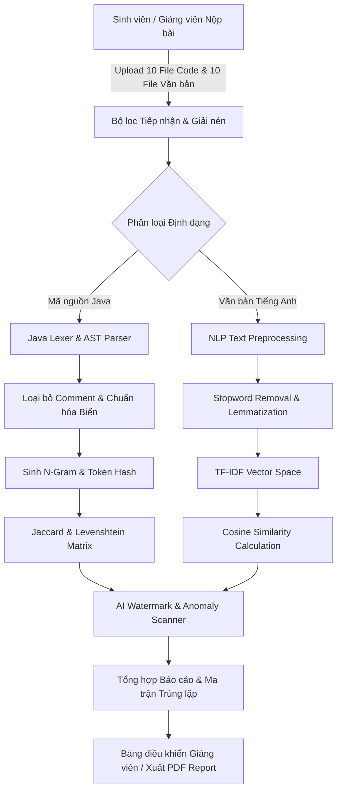

# 🛡️ AITA CodeDefend — AI Plagiarism & Code Similarity Detection Suite

[](https://www.oracle.com/java/)
[](https://jakarta.ee/)
[](https://tomcat.apache.org/)
[](https://maven.apache.org/)
[](https://threejs.org/)
[](https://greensock.com/)
[](LICENSE)

> **Hệ thống Phát hiện Trùng lặp Mã nguồn & Đạo văn Tích hợp AI** — Dự án Nghiên cứu Ứng dụng (RBL - Research-Based Learning) môn **PRJ301** (Nhóm 4).
> Nền tảng cho phép giảng viên và sinh viên nộp bài hàng loạt, phân tích tương đồng thuật toán (Code Similarity) và kiểm tra dấu vết văn bản/mã nguồn sinh bởi AI (LLM Detection).

---

## 📑 Mục Lục
- [Kiến trúc Hệ thống](#-kiến-trúc-hệ-thống)
- [Tính năng Nổi bật](#-tính-năng-nổi-bật)
- [Luồng Hoạt động (Pipeline Flow)](#-luồng-hoạt-động-pipeline-flow)
- [Thuật toán Đối soát](#-thuật-toán-đối-soát)
- [Yêu cầu Môi trường](#-yêu-cầu-môi-trường)
- [Hướng dẫn Cài đặt & Chạy](#-hướng-dẫn-cài-đặt--chạy)
- [Cấu trúc Thư mục](#-cấu-trúc-thư-mục)
- [Thành viên Nhóm](#-thành-viên-nhóm)

---

## 🏛️ Kiến trúc Hệ thống

```
+-------------------------------------------------------------------------+
|                        Modern Web UI Layer                              |
|   - 3D Scrollytelling (Three.js WebGL + Cyber Shield GLB Model)        |
|   - Liquid Glass UI 2026 / GSAP 3 ScrollTrigger                         |
|   - Multi-role Dashboards (Student / Instructor / Admin)                |
+-------------------------------------------------------------------------+
                                    │ HTTP / REST / JSP
                                    ▼
+-------------------------------------------------------------------------+
|                   Backend Service Layer (Jakarta EE 6)                  |
|   - Auth & Session Controller (Google OAuth2 + Form Auth)               |
|   - Submission & Batch File Processor (.java, .txt, .docx, .zip)        |
|   - Plagiarism & Similarity Calculation Service                         |
|   - AI Content Heuristic & Detection Engine                             |
+-------------------------------------------------------------------------+
                                    │ JDBC Connection Pool
                                    ▼
+-------------------------------------------------------------------------+
|                       Data Persistence Layer                            |
|   - Microsoft SQL Server / MySQL                                        |
|   - Schemas: Users, Roles, Assignments, Submissions, SimilarityReports  |
+-------------------------------------------------------------------------+
```

---

## ✨ Tính năng Nổi bật

1. **Đối soát Mã nguồn Đa luồng (Code Similarity Engine):**
   - Hỗ trợ tải lên nhiều bài nộp mã nguồn Java cùng lúc.
   - Phân tách Token, loại bỏ comments, chuẩn hóa biến (Identifier Normalization), đối chiếu cấu trúc lệnh (AST/Control Flow).
   - Xuất ma trận độ tương đồng (Similarity Matrix) chi tiết giữa từng cặp bài.

2. **So sánh Văn bản Tiếng Anh & Bài luận (Essay & Text Similarity):**
   - Hỗ trợ nộp bài văn tiếng Anh (định dạng text/doc).
   - Tiền xử lý NLP: Tokenization, Lowercasing, Stop-words removal, Stemming.
   - Tính toán độ tương đồng qua TF-IDF và Cosine Similarity.

3. **Phân tích Dấu vết AI (AI Content & LLM Detection):**
   - Đánh giá Perplexity và Burstiness đặc trưng của các mô hình ngôn ngữ lớn (ChatGPT, Gemini, Claude).
   - Phát hiện các mẫu câu rập khuôn, cấu trúc mã nguồn sinh tự động, cảnh báo mức độ can thiệp của AI.

4. **Trải nghiệm Thị giác 3D Đột phá (3D Cinematic Scrollytelling):**
   - Mô hình 3D chiếc khiên công nghệ Cyber Shield tương tác thời gian thực.
   - Camera 3D di chuyển mượt mà theo tiến trình cuộn trang bằng GSAP ScrollTrigger.
   - Giao diện Liquid Glass phong cách tương lai 2026.

5. **Khởi chạy 1-Click Tương thích Đa máy (Multi-Machine Portable):**
   - Kịch bản `CHAY_ALL.bat` tự động quét tìm JDK (Java 17, 21, 23...), cấu hình môi trường, build Maven và chạy ứng dụng mà không cần thiết lập biến môi trường thủ công.

---

## 🔄 Luồng Hoạt động (Pipeline Flow)



---

## ⚙️ Thuật toán Đối soát

| Hạng mục | Thuật toán Áp dụng | Mục đích |
| :--- | :--- | :--- |
| **Java Code** | Token-based Jaccard Index | Đo tỷ lệ tập từ khóa và lệnh trùng lặp |
| **Java Code** | Normalized Levenshtein Distance | Đo khoảng cách chỉnh sửa giữa chuỗi token |
| **English Text** | TF-IDF + Cosine Similarity | So sánh góc vector giữa các bài luận |
| **English Text** | 3-Gram Overlap | Phát hiện sao chép nguyên văn từng đoạn |
| **AI Detection** | Heuristic Perplexity & Structure Analysis | Đánh giá xác suất văn bản do AI sinh |

---

## 💻 Yêu cầu Môi trường

- **Java:** JDK 17 LTS trở lên (khuyên dùng JDK 17 hoặc JDK 21)
- **Apache Maven:** Phiên bản 3.8+
- **Application Server:** Apache Tomcat 10.1+ (Hỗ trợ Jakarta EE 6)
- **Cơ sở dữ liệu:** Microsoft SQL Server (2019+) hoặc MySQL (8.0+)
- **Trình duyệt:** Chrome, Edge, Brave, Firefox (Hỗ trợ WebGL cho 3D)

---

## 🚀 Hướng dẫn Cài đặt & Chạy

### Cách 1: Chạy tự động 1-Click (Khuyên dùng trên Windows)

1. Clone repository về máy:
   ```bash
   git clone https://github.com/Phucstack/aita-plagiarism-detection.git
   cd aita-plagiarism-detection
   ```
2. Nhấp đúp chạy file **`CHAY_ALL.bat`** (hoặc mở Command Prompt chạy `CHAY_ALL.bat`).
   - Script sẽ tự nhận diện Java, biên dịch mã nguồn và khởi động hệ thống.
3. Để xem nhanh giao diện Web tĩnh: Nhấp đúp chạy **`CHAY_NHANH_WEB.bat`** và truy cập `http://localhost:8089`.

---

### Cách 2: Chạy thủ công với Maven & Tomcat

1. **Biên dịch dự án:**
   ```bash
   mvn clean package
   ```
   File WAR hoàn chỉnh sẽ nằm tại: `target/aita-plagiarism-detection-1.0.0-SNAPSHOT.war`.

2. **Triển khai lên Tomcat:**
   - Copy file WAR vào thư mục `webapps/` của Apache Tomcat 10.1.
   - Khởi động Tomcat bằng lệnh: `bin/startup.bat` (Windows) hoặc `bin/startup.sh` (Linux/macOS).
   - Truy cập: `http://localhost:8080/aita-plagiarism-detection-1.0.0-SNAPSHOT`

---

## 📂 Cấu trúc Thư mục

```
AITA-CodeDefend-PRJ301/
├── CHAY_ALL.bat                         # Kịch bản chạy toàn diện đa máy
├── CHAY_NHANH_WEB.bat                   # Kịch bản chạy nhanh web preview
├── database/                            # Scripts tạo bảng và dữ liệu mẫu SQL
│   └── database_schema.sql
├── src/
│   ├── java/                            # Mã nguồn Backend Jakarta EE (Servlets, DAO, Models, Services)
│   └── test/java/                       # Bộ kiểm thử tự động JUnit 5
├── web/                                 # Giao diện Frontend, JSP, Assets
│   ├── assets/
│   │   ├── css/                         # Liquid Glass, Motion Effects, Styles
│   │   ├── js/                          # Three.js 3D Controller, GSAP animations
│   │   └── models/                      # Mô hình 3D cyber-shield.glb
│   ├── index.html                       # 3D Scrollytelling Landing Page
│   └── WEB-INF/                         # web.xml và cấu hình bảo mật
├── pom.xml                              # Cấu hình Maven dependencies & build
├── .gitignore                           # Danh sách loại trừ tệp rác / build
└── README.md                            # Tài liệu dự án
```

---

## 👥 Thành viên Nhóm

- **Môn học:** PRJ301 — Web Applications Development (FPT University)
- **Nhóm thực hiện:** RBL Nhóm 4
- **Đề tài:** AITA CodeDefend - AI Plagiarism & Code Similarity Detection Suite
