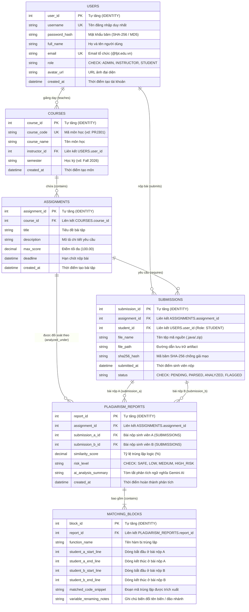

# SƠ ĐỒ QUAN HỆ THỰC THỂ (ERD) - HỆ THỐNG AITA
## NHÓM 4: AI PLAGIARISM & CODE SIMILARITY DETECTION
### ĐÁP ỨNG TIÊU CHUẨN ĐÁNH GIÁ PRJ301 / PRJ30x (10 ĐIỂM DATABASE DESIGN)

---

## 1. Sơ Đồ ERD Trực Quan (Entity-Relationship Diagram)

---

## 2. Thuyết Minh Chuẩn Hóa 3NF & Ràng Buộc Dữ Liệu

1. **Chuẩn 1NF (First Normal Form):**
   - Mọi thuộc tính đều là giá trị nguyên tử (atomic), không chứa mảng lồng nhau.
   - Các dòng code trùng lặp chi tiết được tách biệt vào bảng `MatchingBlocks` thay vì lưu text gộp trong `PlagiarismReports`.

2. **Chuẩn 2NF (Second Normal Form):**
   - Toàn bộ các bảng đều sử dụng Khóa chính đơn (`user_id`, `course_id`, `assignment_id`, `submission_id`, `report_id`, `block_id`), loại bỏ hoàn toàn sự phụ thuộc bộ phận vào một phần của khóa.

3. **Chuẩn 3NF (Third Normal Form):**
   - Loại bỏ phụ thuộc bắc cầu (Transitive Dependency). Ví dụ: `Submissions` chỉ lưu `student_id` và `assignment_id`, không lưu thừa tên môn học hay họ tên sinh viên.

4. **Ràng buộc toàn vẹn & Bảo mật (Integrity & Security):**
   - **Xác thực toàn vẹn mã nguồn (Section 4.4.2):** Cột `sha256_hash` (CHAR 64) trong `Submissions` đảm bảo phát hiện ngay lập tức bất kỳ sự can thiệp nào vào mã nguồn sau khi nộp.
   - **Bảo mật vai trò:** Cột `role` trong bảng `Users` có ràng buộc `CHECK (role IN ('ADMIN', 'INSTRUCTOR', 'STUDENT'))`.
   - **Xóa xếp tầng an toàn:** Ràng buộc `ON DELETE CASCADE` ở các quan hệ cha - con (`Courses` -> `Assignments` -> `Submissions`, `PlagiarismReports` -> `MatchingBlocks`) đảm bảo tính nhất quán dữ liệu.
