# SƠ ĐỒ QUAN HỆ THỰC THỂ (ERD) - HỆ THỐNG AITA
## NHÓM 7 (SE20C): AI PLAGIARISM & CODE SIMILARITY DETECTION
### ĐÁP ỨNG TIÊU CHUẨN ĐÁNH GIÁ PRJ301 / PRJ30x (10 ĐIỂM DATABASE DESIGN)

---

## 1. Sơ Đồ ERD Trực Quan (Entity-Relationship Diagram)

```mermaid
erDiagram
    USERS ||--o{ COURSES : "giảng dạy (teaches)"
    USERS ||--o{ SUBMISSIONS : "nộp bài (submits)"
    COURSES ||--o{ ASSIGNMENTS : "chứa (contains)"
    ASSIGNMENTS ||--o{ SUBMISSIONS : "yêu cầu (requires)"
    SUBMISSIONS ||--o{ PLAGIARISM_REPORTS : "bài nộp A (submission_a)"
    SUBMISSIONS ||--o{ PLAGIARISM_REPORTS : "bài nộp B (submission_b)"
    PLAGIARISM_REPORTS ||--o{ MATCHING_BLOCKS : "bao gồm (contains)"

    USERS {
        int user_id PK "Tự tăng (IDENTITY)"
        string username UK "Tên đăng nhập duy nhất"
        string password_hash "PBKDF2-HMAC-SHA256; MD5/SHA-256 chỉ để migration legacy"
        string full_name "Họ và tên người dùng"
        string email UK "Email tổ chức (@fpt.edu.vn)"
        string role "CHECK: ADMIN, INSTRUCTOR, STUDENT"
        string avatar_url "URL ảnh đại diện"
        string google_subject UK "Google subject duy nhất khi đã liên kết"
        datetime created_at "Thời điểm tạo tài khoản"
    }

    COURSES {
        int course_id PK "Tự tăng (IDENTITY)"
        string course_code UK "Mã môn học (vd: PRJ301)"
        string course_name "Tên môn học"
        int instructor_id FK "Liên kết USERS.user_id"
        string semester "Học kỳ (vd: Fall 2026)"
        datetime created_at "Thời điểm tạo môn"
    }

    ASSIGNMENTS {
        int assignment_id PK "Tự tăng (IDENTITY)"
        int course_id FK "Liên kết COURSES.course_id"
        string title "Tiêu đề bài tập"
        string description "Mô tả chi tiết yêu cầu"
        decimal max_score "Điểm tối đa (100.00)"
        datetime deadline "Hạn chót nộp bài"
        decimal similarity_threshold "Ngưỡng HIGH_RISK của bài tập"
        datetime created_at "Thời điểm tạo bài tập"
    }

    SUBMISSIONS {
        int submission_id PK "Tự tăng (IDENTITY)"
        int assignment_id FK "Liên kết ASSIGNMENTS.assignment_id"
        int student_id FK "Liên kết USERS.user_id (Role: STUDENT)"
        string file_name "Tên tệp mã nguồn (.java/.zip)"
        string file_path "Đường dẫn lưu trữ artifact"
        string file_type "CHECK: JAVA, TEXT, DOCX, ZIP"
        string sha256_hash "Mã băm SHA-256 chống giả mạo"
        datetime submitted_at "Thời điểm sinh viên nộp"
        string status "CHECK: PENDING, PARSED, ANALYZED, FLAGGED"
    }

    PLAGIARISM_REPORTS {
        int report_id PK "Tự tăng (IDENTITY)"
        int submission_a_id FK "Bài nộp sinh viên A (SUBMISSIONS)"
        int submission_b_id FK "Bài nộp sinh viên B (SUBMISSIONS)"
        decimal similarity_score "Tỷ lệ trùng lặp logic (%)"
        string risk_level "CHECK: SAFE, LOW, MEDIUM, HIGH_RISK"
        string ai_analysis_summary "Tóm tắt phân tích ngữ nghĩa Gemini AI"
        datetime created_at "Thời điểm hoàn thành phân tích"
    }

    MATCHING_BLOCKS {
        int block_id PK "Tự tăng (IDENTITY)"
        int report_id FK "Liên kết PLAGIARISM_REPORTS.report_id"
        string function_name "Tên hàm bị trùng lặp"
        int student_a_start_line "Dòng bắt đầu ở bài nộp A"
        int student_a_end_line "Dòng kết thúc ở bài nộp A"
        int student_b_start_line "Dòng bắt đầu ở bài nộp B"
        int student_b_end_line "Dòng kết thúc ở bài nộp B"
        string matched_code_snippet "Đoạn mã trùng lặp được trích xuất"
        string variable_renaming_notes "Ghi chú biến đổi tên biến / đảo nhánh"
    }
```

---

## 2. Thuyết Minh Chuẩn Hóa 3NF & Ràng Buộc Dữ Liệu

1. **Chuẩn 1NF (First Normal Form):**
   - Mọi thuộc tính đều là giá trị nguyên tử (atomic), không chứa mảng lồng nhau.
   - Các dòng code trùng lặp chi tiết được tách biệt vào bảng `MatchingBlocks` thay vì lưu text gộp trong `PlagiarismReports`.

2. **Chuẩn 2NF (Second Normal Form):**
   - Toàn bộ các bảng đều sử dụng Khóa chính đơn (`user_id`, `course_id`, `assignment_id`, `submission_id`, `report_id`, `block_id`), loại bỏ hoàn toàn sự phụ thuộc bộ phận vào một phần của khóa.

3. **Chuẩn 3NF (Third Normal Form):**
   - Loại bỏ phụ thuộc bắc cầu (Transitive Dependency). Ví dụ: `Submissions` chỉ lưu `student_id` và `assignment_id`, không lưu thừa tên môn học hay họ tên sinh viên.
   - `PlagiarismReports` không lưu `assignment_id` vì thuộc tính này đã được xác định bởi `submission_a_id`/`submission_b_id`. Assignment của report được suy ra qua `Submissions.assignment_id`, tránh phụ thuộc bắc cầu `report_id -> submission_id -> assignment_id`.
   - Trigger `TR_PlagiarismReports_SameAssignment` bắt buộc hai submission trong cùng report phải thuộc cùng một assignment, giữ toàn vẹn dữ liệu mà không cần lưu lặp `assignment_id`.
   - `risk_level` và `ai_analysis_summary` là snapshot của lần phân tích tại `created_at`; chúng không được hiểu là dữ liệu luôn tái suy ra từ cấu hình assignment hiện tại.

4. **Ràng buộc chưa có (đã biết, ghi nhận trung thực):**
   - Chưa có `UNIQUE (submission_a_id, submission_b_id)` và chưa có ràng buộc `submission_a_id < submission_b_id`. Về lý thuyết có thể tồn tại cả hai bản ghi `(1,2)` và `(2,1)` cho cùng một cặp bài nộp, khiến ma trận tương đồng hiển thị hai ô khác nhau cho cùng một cặp.
   - Chưa có ràng buộc ở tầng CSDL bảo đảm `Courses.instructor_id` trỏ tới `Users` có `role = 'INSTRUCTOR'` (hoặc Admin), và `Submissions.student_id` trỏ tới `Users` có `role = 'STUDENT'`. Hiện việc này được kiểm soát ở tầng ứng dụng: controller chỉ gán `instructor_id`/`student_id` từ người dùng đang đăng nhập và chỉ cho phép vai trò tương ứng thực hiện.
   - Hai mục trên là hạng mục dự kiến bổ sung ở các tuần tiếp theo, không được trình bày là đã có.

5. **Ràng buộc toàn vẹn & Bảo mật (Integrity & Security):**
   - **Xác thực toàn vẹn mã nguồn (Section 4.4.2):** Cột `sha256_hash` (`VARCHAR(64)`) trong `Submissions` lưu checksum SHA-256 để đối chiếu tính toàn vẹn artifact.
   - **Bảo mật mật khẩu:** Mật khẩu mới dùng PBKDF2-HMAC-SHA256 với salt ngẫu nhiên; MD5/SHA-256 chỉ được chấp nhận cho dữ liệu legacy và được nâng cấp sang PBKDF2 sau khi đăng nhập hợp lệ.
   - **Google Identity:** `google_subject` có unique filtered index, chỉ cho phép một tài khoản liên kết với một Google subject không-null.
   - **Bảo mật vai trò:** Cột `role` trong bảng `Users` có ràng buộc `CHECK (role IN ('ADMIN', 'INSTRUCTOR', 'STUDENT'))`.
   - **Toàn vẹn báo cáo:** `submission_a_id` và `submission_b_id` phải khác nhau và cùng thuộc một assignment; trigger trên `Submissions` ngăn cập nhật làm phá vỡ invariant này.
   - **Xóa xếp tầng an toàn:** Ràng buộc `ON DELETE CASCADE` ở các quan hệ cha - con (`Courses` -> `Assignments` -> `Submissions`, `PlagiarismReports` -> `MatchingBlocks`) đảm bảo tính nhất quán dữ liệu.
